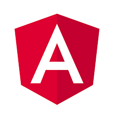

[](https://angular.io/) [](https://electron.atom.io/)

[](https://travis-ci.org/maximegris/angular-electron)
[](https://dependencyci.com/github/maximegris/angular-electron)
[](https://github.com/maximegris/angular-electron/blob/master/LICENSE.md)

# Introduction

Bootstrap and package your project with Angular 4 and Electron (Typescript + SASS)

Currently runs with:

- Angular v4.0.2
- Angular-CLI v1.0.0
- Electron v1.6.5
- Electron Packager v8.6.0

With this sample, you can :

- Run your app in a local development environment with Electron & Hot reload
- Run your app in a production environment
- Package your app into an executable file for Linux, Windows & Mac

## Getting Started

Clone this repository locally :

``` bash
git clone https://github.com/maximegris/angular-electron.git
```

Install dependencies with your favorite dependencies manager (npm or yarn) :

``` bash
npm install
```

If you want to generate Angular components with Angular-cli , you **MUST** install `@angular/cli` in npm global context.  
Please follow [Angular-cli documentation](https://github.com/angular/angular-cli) if you had installed a previous version of `angular-cli`.

``` bash
npm install -g @angular/cli
```

## To build for development

- **in a terminal window** -> npm start  
- **in another terminal window** -> npm run electron:serve

Voila! You can use your Angular + Electron app in a local development environment with hot reload !

The application code is managed by `main.js`. In this sample, the app runs with a simple Electron window and "Developer Tools" is open.  
The Angular component contains an example of Electron and NodeJS native lib import. See [Use NodeJS Native libraries](#use-nodejs-native-libraries) charpter if you want to import other native libraries in your project.  
You can desactivate "Developer Tools" by commenting `win.webContents.openDevTools();` in `main.js`.

## To build for production

- Using development variables (environments/index.ts) :  `npm run electron:dev`
- Using production variables (environments/index.prod.ts) :  `npm run electron:prod`

Your built files are in the /dist folder.

## Included Commands

- `npm run start:web` - Execute the app in the brower
- `npm run electron:linux` - builds your application and creates an app consumable on linux systems.
- `npm run electron:windows` - On a Windows OS, builds your application and creates an app consumable in windows 32/64 bit systems.
- `npm run electron:mac` - On a MAC OS, builds your application and generates a `.app` file of your application that can be run on Mac.

**Your application is optimised. Only the files of /dist folder are included in the executable.**

## Use NodeJS Native libraries

Actually Angular-Cli doesn't seem to be able to import nodeJS native libs or electron libs at compile time (Webpack error).
If you need to use NodeJS native libraries like 'fs' or 'os', you **MUST** add it manually in the file `webpack.config.js` in root folder :

```javascript
  "externals": {
    "child_process": 'require(\'child_process\')',
    "electron": 'require(\'electron\')',
    "fs": 'require(\'fs\')'
  },
```

## Browser mode

Maybe you want to execute the application in the browser ? You can do it with `npm run start:web`.  
Note that you can't use Electron or NodeJS native libraries in this case. Please check `providers/electron.service.ts` to watch how conditional import of electron/Native libraries is done.

## Execute E2E tests

You can find end-to-end tests in /e2e folder.

Before executing e2e scripts, you may need to update drivers libraries : `npm run pree2e`

You can now execute tests with the command lines below : 
- **in a terminal window** -> First, start a web server on port 4200 : `npm run start:web`  
- **in another terminal window** -> Then, execute Protractor : `npm run e2e`

